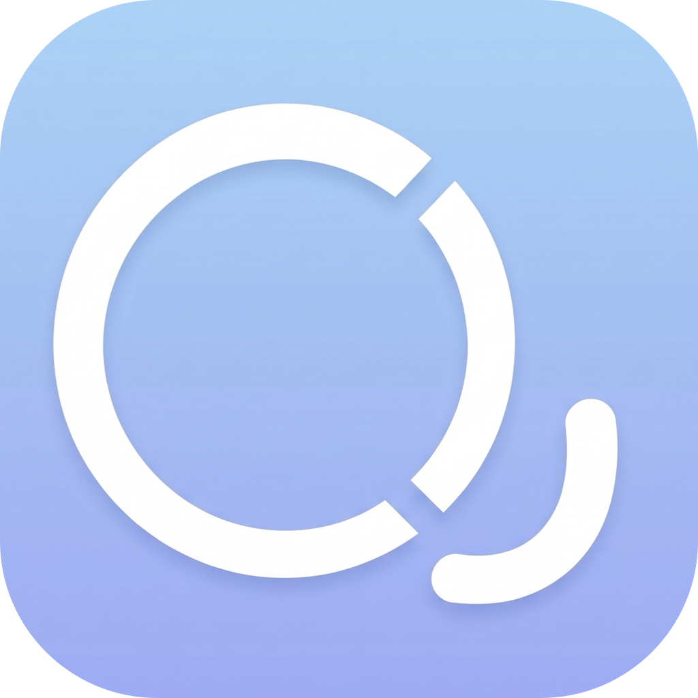

<p align="center">
  
</p>

<h1 align="center">HiRodrop</h1>

<p align="center">
  在 macOS 上與 Android Quick Share 及官方 Windows Quick Share 互傳檔案
</p>

<p align="center">
  <strong>English:</strong> HiRodrop is an open-source macOS app for transferring files to and from Android Quick Share and Google's official Quick Share for Windows. It is currently in beta, and the primary documentation is in Traditional Chinese.
  <br>
  <strong>日本語:</strong> HiRodrop は、Android の Quick Share および Google 公式 Windows 版 Quick Share とファイルを送受信するための、オープンソースの macOS アプリです。現在はベータ版で、主なドキュメントは繁体字中国語で提供しています。
</p>

> 既然無法在 Android 花圃裡培育蘋果，<br>
> 那就在蘋果王國裡蓋一座 Android 城堡。

HiRodrop 是一套建立在 Quick Share 相容協定上的 macOS 應用程式，透過現有區域網路探索裝置並傳輸資料。它可以與 Android 內建的 Quick Share，以及 Google 官方 Windows Quick Share 互相傳送與接收檔案；手機端不必另外安裝 App，傳輸內容也不會經過 HiRodrop 的雲端伺服器。

> [!WARNING]
> HiRodrop 目前仍是 Beta 版本。請先備份重要資料，並優先使用測試檔案驗證功能。使用前也請閱讀下方的[已知限制](#已知限制)與[免責聲明](#免責聲明)。

## 功能

- 比照官方軟體的操作方式，以 PIN 核對及明確同意流程進行檔案傳送與接收。
- 透過電腦現有的乙太網路或 Wi-Fi 在同一區域網路內傳輸；啟用用戶端隔離或裝置彼此無法連線的網路環境無法使用。
- 以 QR code 和 Android 裝置建立傳送工作階段。
- 探索區域網路上可見的官方 Quick Share 裝置。
- 支援多檔案與資料夾傳輸。
- 支援 Finder「服務」與 macOS「分享延伸功能」快速入口；首次使用需至系統設定中啟用。
- 提供繁體中文、日文與英文介面。
- 提供 Apple Silicon 與 Intel Mac 共用的 Universal 2 執行版本。

## 相容性

| 傳送方向 | 狀態 |
| --- | --- |
| HiRodrop macOS → HiRodrop macOS | 已實作 |
| Android Quick Share → macOS | 已實作 |
| macOS → Android Quick Share | 已透過 QR code 連線方式實作 |
| 官方 Windows Quick Share → macOS | 已實作 |
| macOS → 官方 Windows Quick Share | 已實作 |
| iOS／iPadOS | 尚未支援 |

Android 端請直接使用系統內建的 Quick Share。Windows 端可前往 [Google 官方網站下載 Quick Share](https://www.android.com/filetransfer/)；Samsung Windows 電腦請依該頁面的說明使用 Microsoft Store 提供的 Samsung 版本。

這個儲存庫只包含 macOS 應用程式，沒有 iOS App、Windows App 或這些平台的安裝程式。程式碼中保留 Windows 與 Quick Share 相關的協定值及測試，作為與官方 Windows 用戶端互通所需的一部分。

## 使用 DMG 安裝

打開發行頁提供的 DMG，將 **HiRodrop** 拖入「應用程式」。本專案目前由學生利用課餘時間獨立開發，尚未使用付費 Apple Developer ID，因此發行版採用 ad-hoc 臨時簽章，無法送交 Apple 公證。第一次啟動時，可能需要前往「系統設定 → 隱私權與安全性」選擇「仍要打開」。

先開啟 HiRodrop 一次，讓 macOS 註冊 Finder 整合功能。之後可在 Finder 選取檔案或資料夾，使用以下任一方式：

- **按住 Control 點按 → 服務 → 使用 HiRodrop 傳送**；或
- **分享⋯ → 使用 HiRodrop 傳送**。

若分享項目沒有出現，請前往「系統設定 → 一般 → 登入項目與延伸功能 → 分享」啟用 HiRodrop。

## 使用方式

### 接收檔案

1. 依需求在設定中調整對外顯示名稱與下載位置。
2. 打開 HiRodrop，讓「接收」頁面保持可用。
3. 核對兩台裝置顯示的四位數 PIN。
4. 接受傳送要求後，檔案才會開始寫入。

檔案預設儲存於 `~/Downloads/HiRodrop`，可在設定中更改位置。

### 傳送檔案

1. 打開「傳送」頁面，選取或拖入檔案／資料夾。
2. 選擇區域網路上可見的接收裝置。
3. 傳送到 Android 時，顯示 QR code 並使用手機相機或 Quick Share 掃描。
4. 讓接收畫面保持開啟，直到傳輸完成。

## 已知限制

- 在目前的 Samsung One UI 8.5 實測中，開啟 AirDrop 相容性模式後，官方 Quick Share 可能改變網路連線狀態，造成區域網路中斷、找不到裝置或傳輸失敗。使用 HiRodrop 前請先關閉該相容性模式。
- 程式啟動時的圖示縮放比例仍有待調整。
- 少數情況下，可能需要再次按下傳送按鈕才能正確啟動傳送流程。
- iOS 與 iPadOS 目前尚未支援，後續將視維護時間與協定可行性研究。

## 實測環境

以下為開發期間實際測試過的軟體與裝置，不代表其他版本一定無法使用：

| 軟體或裝置 | 測試版本／環境 |
| --- | --- |
| Google 官方 Windows Quick Share | 1.0.2697 |
| Samsung Android Quick Share | 13.8.53.20 |
| Samsung Galaxy S24 | One UI 8.5 |
| Samsung Galaxy S24 Ultra | One UI 8.0 |
| Windows 桌上型電腦 | 兩台未安裝無線介面卡的裝置 |
| Apple Silicon MacBook Air | macOS 26.5.2 |
| Intel Mac | macOS 26.5 |

## 從原始碼建置

保留建置說明可讓使用者檢查原始碼、重現發行版本，也方便社群參與測試與修改。

需要：

- macOS 12 或更新版本；
- Xcode Command Line Tools；
- 目前仍受支援的 Rust 工具鏈；
- `aarch64-apple-darwin` 與 `x86_64-apple-darwin` Rust target。

```zsh
rustup target add aarch64-apple-darwin x86_64-apple-darwin
cargo test --locked
cargo clippy --locked --all-targets -- -D warnings
zsh packaging/macos/build-app.sh
```

`build-app.sh` 預設會產生 `dist/HiRodrop.app`，並套用 ad-hoc 簽章與 Hardened Runtime。若要建立唯一對外發布的安裝檔：

```zsh
zsh packaging/macos/release-macos.sh
```

產物為 `dist/HiRodrop-macOS-universal.dmg`。若已有 Developer ID Application 憑證及 `notarytool` 鑰匙圈設定檔，可透過 `HIRODROP_SIGN_IDENTITY` 與 `HIRODROP_NOTARY_PROFILE` 提供名稱；憑證與帳號秘密不會儲存在這個專案中。

## 安全性與隱私

- 使用 Quick Share 相容協定的驗證與加密流程保護傳輸連線。
- 寫入前會清理檔名與資料夾路徑。
- 未完成的傳輸使用暫存 `.part` 檔案，失敗時會清除。
- 裝置名稱與 IP 位址不會略過使用者同意流程。
- 設定與傳輸資料只留在本機 Mac 與區域網路內。

目前未啟用信任裝置自動接受或跨工作階段續傳。這些功能需要能與官方裝置核對的協定身份與續傳行為。

安全漏洞請透過 GitHub 的非公開 Security Advisory 回報，詳細方式請參閱 [SECURITY.md](SECURITY.md)。本專案由個人利用課餘時間維護，無法保證固定的回覆或修正時程。

## 免責聲明

本軟體依 GPL-3.0-or-later 授權，以「現狀」提供，不附帶任何明示或默示擔保。使用者應自行評估使用風險，並在傳輸前備份重要資料。在適用法律允許的最大範圍內，作者與貢獻者不對因使用或無法使用本軟體所造成的資料遺失、裝置損壞、服務中斷、經濟損失或其他衍生損害負責。依法不得排除或限制的權利與責任不受本段影響。

## 開發說明

HiRodrop 初版共耗時兩天製作。專案作者透過 OpenAI Codex（GPT-5.6 Sol）與 Google Antigravity（Gemini 3.1 Pro）協作撰寫、整理及測試程式碼；應用程式圖示使用 Gemini 的圖像生成功能製作。所有 AI 產出均由專案維護者審閱、修改並負責最終發布。HiRodrop 並非 OpenAI 或 Google 的官方專案，亦未獲其背書。

## 專案文件

- [參與貢獻指南](CONTRIBUTING.md)
- [社群行為準則](CODE_OF_CONDUCT.md)
- [第三方軟體授權](THIRD_PARTY_LICENSES.md)
- [協定參考來源](docs/protocol-sources.md)
- [版本變更紀錄](CHANGELOG.md)
- [第一次發布至 GitHub](docs/PUBLISHING.md)

## 授權

HiRodrop 採用 GNU General Public License 第 3 版或更新版本（GPL-3.0-or-later）授權。具有法律效力的完整英文條款請參閱 [LICENSE](LICENSE)。

## 商標

HiRodrop 是獨立開發的專案，與 Google、Apple、Microsoft 或 Samsung 沒有隸屬、贊助或背書關係。

Android 是 Google LLC 的商標；Google、Quick Share 及相關產品名稱與標誌，權利歸其各自權利人所有。Apple、AirDrop、Finder、iOS、iPadOS、Mac、MacBook Air 與 macOS 是 Apple Inc. 的商標。Microsoft 與 Windows 是 Microsoft 集團公司的商標。其他公司及產品名稱可能是其各自權利人的商標；本文件僅為說明相容性而提及。
